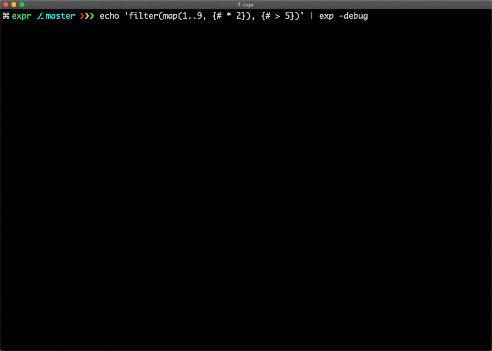

# Expr 
[](https://travis-ci.org/antonmedv/expr) 
[](https://goreportcard.com/report/github.com/antonmedv/expr) 
[](https://godoc.org/github.com/antonmedv/expr)


**Expr** package provides an engine that can compile and evaluate expressions. 
An expression is a one-liner that returns a value (mostly, but not limited to, booleans).
It is designed for simplicity, speed and safety.

The purpose of the package is to allow users to use expressions inside configuration for more complex logic. 
It is a perfect candidate for the foundation of a _business rule engine_. 
The idea is to let configure things in a dynamic way without recompile of a program:

```coffeescript
# Get the special price if
user.Group in ["good_customers", "collaborator"]

# Promote article to the homepage when
len(article.Comments) > 100 and article.Category not in ["misc"]

# Send an alert when
product.Stock < 15
```

## Features

* Seamless integration with Go (no need to redefine types)
* Static typing ([example](https://godoc.org/github.com/antonmedv/expr#example-Env)).
  ```go
  out, err := expr.Compile(`name + age`)
  // err: invalid operation + (mismatched types string and int)
  // | name + age
  // | .....^
  ```
* User-friendly error messages.
* Reasonable set of basic operators.
* Builtins `all`, `none`, `any`, `one`, `filter`, `map`.
  ```coffeescript
  all(Tweets, {.Size <= 280})
  ```
* Fast ([benchmarks](https://github.com/antonmedv/golang-expression-evaluation-comparison#readme)): uses bytecode virtual machine and optimizing compiler.

## Install

```
go get github.com/antonmedv/expr
```

## Documentation

* See [Getting Started](docs/Getting-Started.md) page for developer documentation.
* See [Language Definition](docs/Language-Definition.md) page to learn the syntax.

## Expr Code Editor

<a href="http://bit.ly/expr-code-editor">
	
</a>

Also, I have an embeddable code editor written in JavaScript which allows editing expressions with syntax highlighting and autocomplete based on your types declaration.

[Learn more →](https://antonmedv.github.io/expr/)

## Examples

[demo.go](./docs/examples/demo.go)

```go
package main

import (
	"fmt"
	"time"

	"github.com/antonmedv/expr"
)

var expressions = []string{
	"foo > 0",
	"bar.Value in ['a', 'b', 'c']",
	"name matches '^hello.+$'",
	"now().Sub(startedAt).String()",
	"all(tweets, {len(.Message) <= 280}) ? '👍' : '👎'",
}

var environment = map[string]interface{}{
	"foo":       1,
	"bar":       struct{ Value string }{"c"},
	"name":      "hello world",
	"startedAt": time.Now(),
	"now":       func() time.Time { return time.Now() },
	"tweets":    []tweet{{"first tweet"}},
}

type tweet struct {
	Message string
}

func main() {
	for _, input := range expressions {
		program, err := expr.Compile(input, expr.Env(environment))
		if err != nil {
			panic(err)
		}

		output, err := expr.Run(program, environment)
		if err != nil {
			panic(err)
		}

		fmt.Println(output)
	}
}
```

## Contributing

**Expr** consist of a few packages for parsing source code to AST, type checking AST, compiling to bytecode and VM for running bytecode program.

Also expr provides powerful tool [exe](cmd/exe) for debugging. It has interactive terminal debugger for our bytecode virtual machine.

<p align="center">
    
</p>
    

## Who is using Expr?

* [Aviasales](https://aviasales.ru) are actively using Expr for different parts of the search engine.
* [Mystery Minds](https://www.mysteryminds.com/en/) uses Expr to allow easy yet powerful customization of its matching algorithm.

## License

[MIT](LICENSE)
